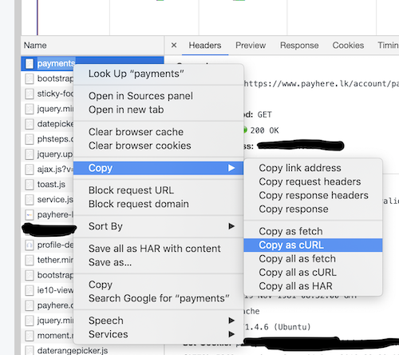

# Payheredump (to CSV)

Dumps transaction information from payhere.lk to a csv file.

## Requirements

* Python 3.6+
* You must have `poetry` installed. (`pip install poetry`)

## Getting the curl command

This script uses the cookies from a pre-existing payhere session. For convenience, we will use the export as curl feature in chrome/firefox to grab the cookies.

Steps:
- Login to payhere lk. You must be at the account dashboard.
- Open chrome inspector and navigate to the network tab.
- Reload the page.
- Find the first entry in the list, right click, "Copy", "Copy as cURL."



- Create a new file in the root call it `curl_command.txt` and paste the curl command.

## Running

```shell
$ poetry install # to install the dependencies, needed only once
$ poetry run inv dump --from-date <yyy-mm-dd> [--to-date <yyyy-mm-dd> (defaults to today)] [--curl-command-file <curl_command.txt>]
```

* Once completed, a full csv file will be generated in the working directory, along with the exported `xls` files in `exported/<timestamp>/`


## Todo

* [ ] Automatically obtain cookies by logging in to payhere via a headless browser